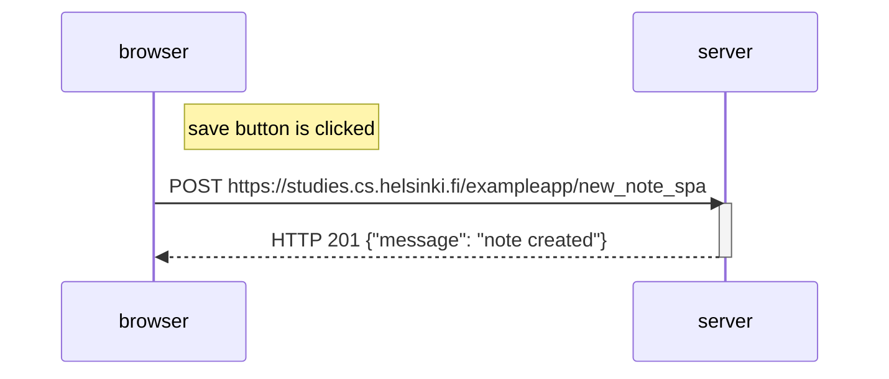

# Exercise 0.6

```mermaid
sequenceDiagram
    participant browser
    participant server

    note right of browser: save button is clicked
    browser->>server: POST https://studies.cs.helsinki.fi/exampleapp/new_note_spa
    activate server
    server-->>browser: HTTP 201 {"message": "note created"}
    deactivate server
```
